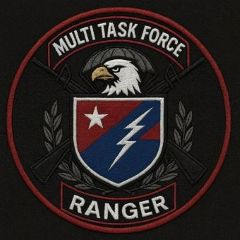

<!-- =========================================================
     MTFU | AIRSOFT OPERATOR PROFILE (GitHub README Uyumlu)
     Operator: Kadir "KADO" | ID: 0003 | Role: DMR
     Unit: VIPER-1 (Leader) | Team: Multi Task Force Unite (MTFU)
========================================================== -->

  <!-- TOP BANNER / TITLE -->
  

    <!-- HEADER -->
    

      

        

        

          

            AIRSOFT OPERATOR FILE
          

          

            MULTI TASK FORCE UNITE · <b>MTFU</b> · VIPER-1
          

        

      

      

        

          STATUS: <b style="color:#c9ff74;">ACTIVE</b>
        

        

          PROFILE CARD · US MIL CONCEPT
        

      

    

    <!-- CONTENT GRID -->
    

      <!-- LEFT: OPERATOR PHOTO + CORE ID -->
      

        <!-- Team photo (small corner) -->
        

        

        

          

            
<b style="color:#c9ff74;">NAME</b> : KADIR

            
<b style="color:#c9ff74;">AGE</b> : 30

          

          
<b style="color:#c9ff74;">CALLSIGN</b> : KADO

          
<b style="color:#c9ff74;">ROLE</b> : DMR

          
<b style="color:#c9ff74;">OPERATOR ID</b> : 0003

        

        <!-- Small weapon card -->
        

          

            PRIMARY PLATFORM (REF)
          

          
          

            Loadout snapshot · training reference
          

        

      

      <!-- RIGHT: DETAILS -->
      

        <!-- TAGS ROW -->
        

          
<b style="color:#c9ff74;">TEAM</b> : MULTI TASK FORCE UNITE

          
<b style="color:#c9ff74;">TAG</b> : MTFU

          
<b style="color:#c9ff74;">UNIT</b> : VIPER-1

          
<b style="color:#c9ff74;">POSITION</b> : TEAM LEADER

        

        <!-- COMMAND / BIO -->
        

          

            COMMAND & STATUS
          

          

            • <b>Founding Member</b> (Core staff)  
            • <b>Vice Team Captain</b> (Deputy)  
            • <b>VIPER-1</b> · Team Leader & Member
          

          

            NOTE:
            MTFU structure: <b>10 main elements</b>.
          

        

        <!-- MISSION AREAS -->
        

          

            

              MISSION AREAS (TR)
            

            

              Logged locations
            

          

          

            
01 · AYAP

            
02 · KILIÇLI

            
03 · OTTO DOĞA PARKI

            
04 · KURNAKÖY

            
05 · ARNAVUTKÖY

            
06 · ŞİLE

          

          

            Operational footprint · training & scenario deployments.
          

        

        <!-- SOCIAL LINKS (2 IG + 1 YT) -->
        

          

            CONTACT / SOCIAL
          

          

            <a href="https://instagram.com/KULLANICI_ADI_1" style="text-decoration:none;">
              
INSTAGRAM · 01

            </a>

            <a href="https://instagram.com/KULLANICI_ADI_2" style="text-decoration:none;">
              
INSTAGRAM · 02

            </a>

            <a href="https://www.youtube.com/@KULLANICI_ADI" style="text-decoration:none;">
              
YOUTUBE

            </a>

          

          

            Username alanlarını sen dolduracaksın.
          

        

        <!-- FOOTER -->
        

          
ISSUED: 2026 · MTFU FILE

          
VERIFIED · VIPER-1

        

      

    

  

